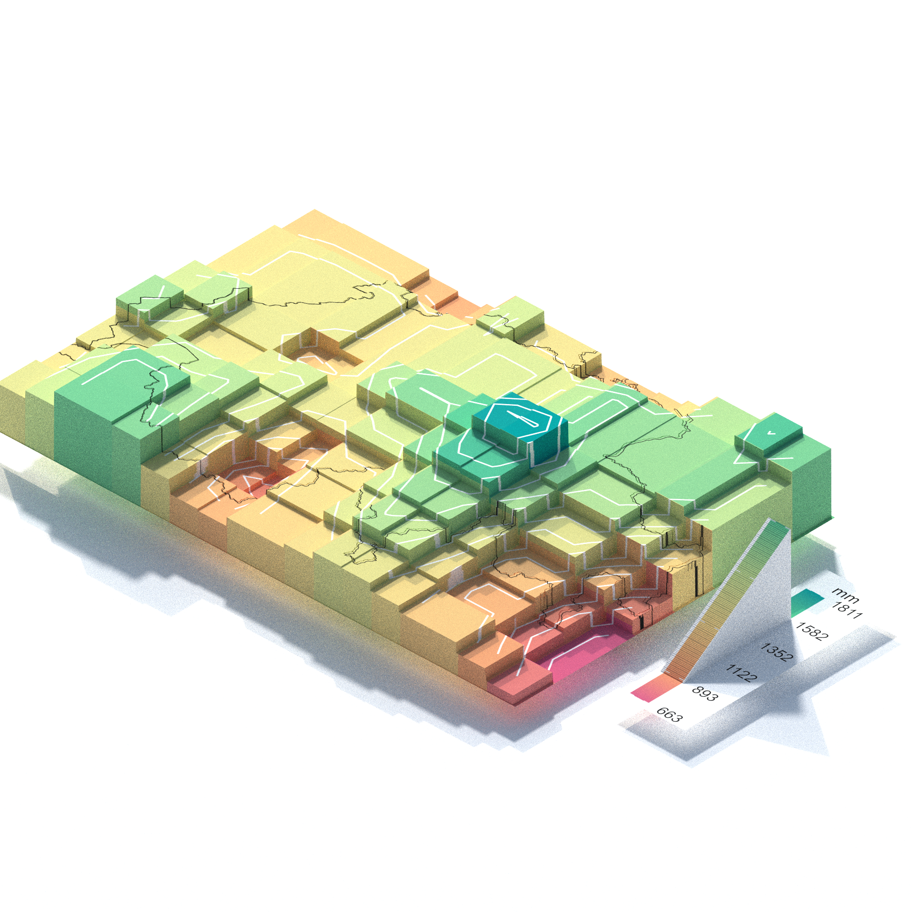
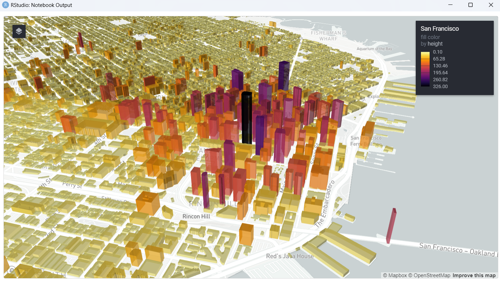

# **ProtocolR_Readme**

Hello, welcome to the repository that uses R for mapping and other projects!

## **Entry 4: REM using Lidar Data**

Tutorial Source: [Unleash GIS Power: Create Jaw-Dropping REM Maps with Lidar Data in R!](https://www.youtube.com/watch?v=x8is770F7Og&ab_channel=MilosMakesMaps)

## **Entry 3: Precipitation Maps 3D**

Tutorial Source: [How to Create Amazing Precipitation Maps with R in 2D and 3D](https://www.youtube.com/watch?v=9Ex-f66qe2w)

## **Entry 2: Overture Maps buildings data**

Tutorial Source: [Getting and visualizing Overture Maps buildings data in R](https://walker-data.com/posts/overture-buildings/)

## **Entry 1: Shipping Traffic**

Tutorial Source: [Sail the Data Sea: Charting the World's Shipping Lanes with R ](https://www.youtube.com/watch?v=k7xWK4rp5pY)
